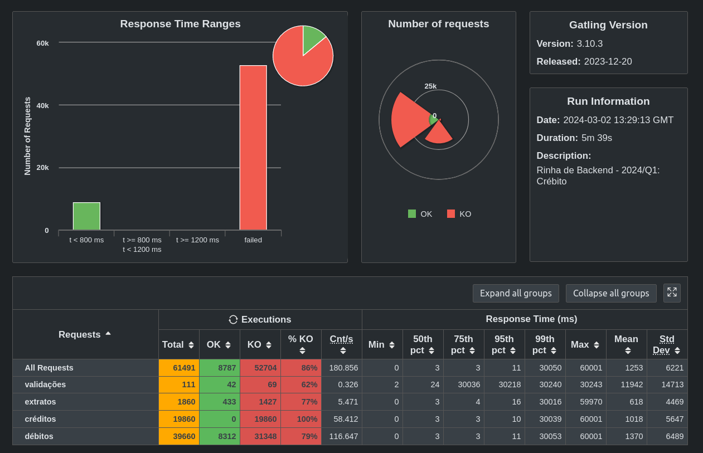
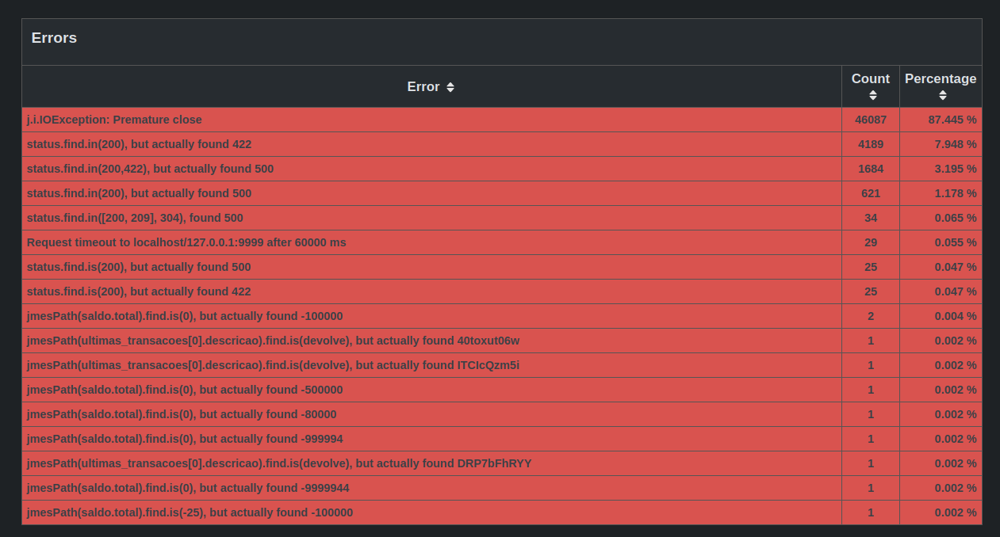
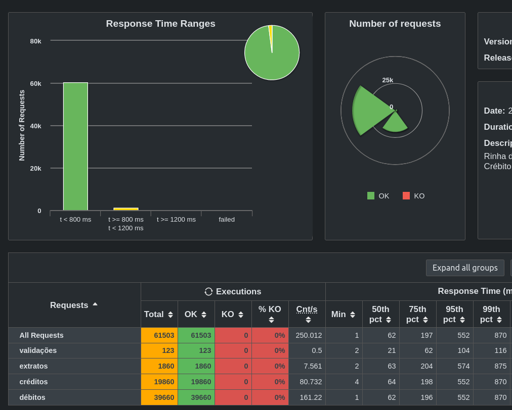

# phase2_deploy
In the previous module, we wrote some unit tests to ensure that our functions worked as expected. Now, we need to deploy this code so that we can have 2 instances of our api running (required by the competition's specifications). Recall that, to make requests to our api we needed it up as well as the database and, to do so, we were executing our program on one terminal window and the database on the other, through an image of Postgres on Docker Hub. This is not very practical, so what about deploying all of our services (the api instances, the database and the load balancer) "automatically"?

## Docker
Using docker allows us to publish images of our code so that others can access it, but more than that, we can define some aspects related to how to run our code and the conditions under which it must happen. Through the command:
```
docker init
```
we are prompted with a cli to choose some options. After that, we are presented with 3 files: a `Dockerfile`, which tells Docker how to create an image of our api. For instance, here we can define which ports this api listens to, some environment variables and even other images that our api requires to run. The other file is `.dockerignore`, which basically tells Docker not to include these files when creating the image. Lastly, `compose.yaml` in which we can define and run all services that our suite provides, each running in its own container.

In the docker compose file, we define our 4 services: the database, the load balancer and the two api instances. For each service, we can define individually which ports it will listen to, the required environment variables and the available resources (another competition requirement). This enables us to start all of our services by simply typing:
```
docker compose up --build
```

## Testing
Now that our services are up it's time to test if they are still working correctly. One thing to mention is that, previously we were making requests to `localhost:3000` because we only had one instance of our api, but now we have 2 so how can we determine which instance will handle our request? This can be achieved through the use of a load-balancer, which forwards requests to our apis using the round-robin algorithm (essentially, if api01 handled the last request, the current one goes to api02 and so on). Therefore, we have to send our requests to the load balancer, which listens on port 9999. We still receive the expected response from our apis, so now we need to run it against a stress test (provided by the competition), to check for performance improvements.

## Runnning (and correcting some mistakes)
After the first run, the shocking results:




Basically, what both these images show is that our structure for running the services was correct, but it was very inefficient: they were receiving the requests, processing some data and replying with the response, but not always with the expected response. This is a symptom that something was wrong with the logic of our code: in some cases, the test expected a result but got another, so I got on reading line by line of the functions the check what was wrong. It turns out that I erroneously thought that credit and debit transactions had the same behavior, which they don't: the api was always subtracting the value from the client's balance, when it should only do this for debit transactions (for credit, we sum).

After correcting this mistake, I also realized two things that could help with performance: the first is that the api was making validation checks for the request Json body values both in the code and on the database; the other is that we were storing the time that the transactions were executed as TIMESTAMP and then always converting it on the queries to the expected string format. So, I placed all data-related definitions in the `model.rs` file and updated the structs definitions to store a `DateTime<Utc>` value, this way we can deserialize the value on the database to our format.

Surprisingly, these changes indeed improved the performance of our suite (the count of successfully handled requests went up from ~8000 to ~14000), but we were still encountering some errors like "expected X value but got Y". This was very frustrating because there were no more logic-related mistakes in the code. So, I thought it was working before with one instance but with two it doesn't", which reminded me of race condition: in simple words, if services A and B try to update the same resource on the database at the same time and then read this value, one of them won't get the expected result. This could be the problem that my suite was facing.

To address this situation, I thought about using locks to restrict that only one function can access the database at a time, which can be done through:
```rust
type DbPool = Arc<Mutex<PgPool>>;
```

So, instead of passing our connection pool to the functions that access the database, we pass a lock to the poll, and the function that has the lock, has access to the database. Simply doing this made our suite have 0 errors when tested under the stress test and have a 100% response rate (every request was answered correctly).

