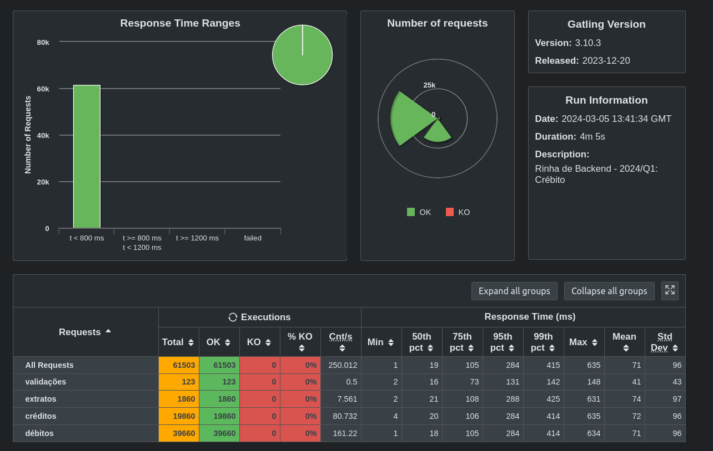

# phase3_optimizations
The following image displays the results before doing the optimizations:

Initially, I tried changing some of the values on the docker compose file, but it just made the performance worse. The unique relevant changes were that I added the `opt-level = 3` to the release profile and the `"http2"` to axum, in the `Cargo.toml` file. The results:

[alt text](../images/final_run.png)
